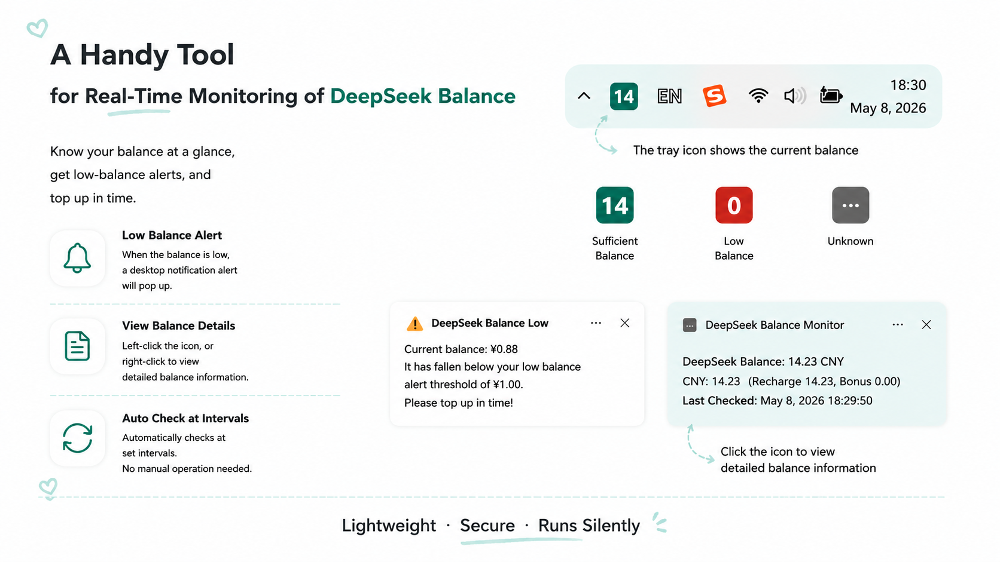

# DeepSeek Balance Monitor / DeepSeek 余额监控

A Windows system tray application that periodically queries the DeepSeek API for account balance, displays it as a dynamic tray icon, and alerts on low balance.

一个 Windows 系统托盘应用，定时查询 DeepSeek API 账户余额，以动态图标形式显示在任务栏，余额过低时弹窗提醒。



---

## English

### Features

- **Tray icon with balance** — Your current balance is shown as a number on a coloured rounded rectangle in the taskbar. Teal when above threshold, red when low or errored, gray before the first check.
- **Low balance notification** — A desktop notification fires when balance drops below your configured threshold. Alerts can be disabled in settings; the icon still turns red regardless.
- **Balance details** — Left-click the icon (or right-click → View Balance) to see a full breakdown: total, topped-up, and granted balance per currency, plus last check time.
- **Settings** — API key, check interval (1–1440 min), alert threshold, language (Chinese / English), and auto-start on boot — all in one dialog. Opens automatically on first launch if no key is configured.

#### Notification Previews

**Normal balance view:**

> DeepSeek Balance: 12.34 CNY
> 
> CNY: 12.34  (Topped 10.00, Granted 2.34)
> Last Check: 2026-05-08 14:30:00

**Low balance alert:**

> ⚠ DeepSeek Low Balance
> 
> Balance is only 0.50, below your alert threshold of 1.00.
> Please top up!

### Direct Download

Grab the latest `DeepSeekBalanceMonitor.exe` from [Releases](https://github.com/SrtaEstrella/DeepSeekBalanceMonitor/releases). No Python required — just double-click to run. On first launch you'll be prompted to enter your API key.

### Run from Source

Requires Python 3.10+.

```bash
pip install -r requirements.txt
python main.py
```

On first launch the settings window opens automatically — enter your DeepSeek API key. The app lives in the system tray; left-click the icon to view balance, right-click for the menu.

### Building the EXE

Requires Python 3.10+ and PyInstaller.

```bash
pip install pyinstaller
scripts\build_exe.bat
```

Builds `dist\DeepSeekBalanceMonitor.exe` as a single-file executable.

### Project Structure

```
DeepSeekBalance/
├── src/                       # Application package
│   ├── config.py
│   ├── api_client.py
│   ├── icon_renderer.py
│   ├── app_state.py
│   ├── settings_dialog.py
│   └── tray_app.py
├── scripts/                   # Build & utility scripts
│   ├── generate_icon.py

│   ├── build_exe.bat
│   ├── setup.bat
│   └── run_silent.vbs
├── main.py
├── requirements.txt
└── README.md
```

### Configuration

Settings are stored in `%APPDATA%\DeepSeek Balance Monitor\config.json`:

```json
{
  "api_key": "sk-xxxxxxxx",
  "interval_minutes": 10,
  "threshold_yuan": 1.0,
  "language": "zh",
  "auto_start": false,
  "enable_alerts": true
}
```

Logs are written to `%APPDATA%\DeepSeek Balance Monitor\app.log`.

### Tray Menu

| Action | Trigger |
|---|---|
| View Balance | Left-click the icon, or Right-click → View Balance |
| Check Now | Right-click → Check Now |
| Settings | Right-click → Settings |
| Quit | Right-click → Quit |

### Icon Colours

| Colour | Meaning |
|---|---|
| Teal | Balance is above the alert threshold |
| Red | Balance is below threshold, or an API error occurred |
| Gray | First check not yet completed, or no API key configured |

### License

MIT

---

## 中文

### 功能

- **托盘图标显示余额** — 当前余额以数字形式显示在任务栏圆角矩形图标上。青色表示高于阈值，红色表示低于阈值或出错，灰色表示尚未完成首次查询。
- **低余额通知** — 余额低于设定阈值时弹出桌面通知。可在设置中关闭通知，关闭后图标仍会变红作为视觉提醒。
- **余额详情** — 左键单击图标（或右键 → 查看余额）可查看完整明细：每种币种的总余额、充值余额、赠送余额，以及上次查询时间。
- **设置** — API Key、查询间隔（1–1440 分钟）、预警阈值、语言（中文 / English）、开机自启，集中在一个设置窗口中配置。首次启动若未配置 Key 会自动弹出。

#### 通知预览

**查看余额：**

> DeepSeek 余额: 12.34 CNY
> 
> CNY: 12.34  (充值 10.00, 赠送 2.34)
> 上次查询: 2026-05-08 14:30:00

**低余额告警：**

> ⚠ DeepSeek 余额不足
> 
> 当前余额仅剩 0.50，已低于您设置的提醒阈值 1.00。
> 请及时充值！

### 直接下载

从 [Releases](https://github.com/SrtaEstrella/DeepSeekBalanceMonitor/releases) 下载最新的 `DeepSeekBalanceMonitor.exe`，无需 Python 环境，双击即用。首次启动会提示输入 API Key。

### 源码运行

需要 Python 3.10+。

```bash
pip install -r requirements.txt
python main.py
```

首次运行会自动弹出设置窗口，输入 DeepSeek API Key。应用常驻系统托盘，左键单击图标查看余额，右键打开菜单。

### 构建 EXE

需要 Python 3.10+ 和 PyInstaller。

```bash
pip install pyinstaller
scripts\build_exe.bat
```

构建为单文件 `dist\DeepSeekBalanceMonitor.exe`。

### 项目结构

```
DeepSeekBalance/
├── src/                       # 应用主包
│   ├── config.py
│   ├── api_client.py
│   ├── icon_renderer.py
│   ├── app_state.py
│   ├── settings_dialog.py
│   └── tray_app.py
├── scripts/                   # 构建与工具脚本
│   ├── generate_icon.py

│   ├── build_exe.bat
│   ├── setup.bat
│   └── run_silent.vbs
├── main.py
├── requirements.txt
└── README.md
```

### 配置

配置文件路径：`%APPDATA%\DeepSeek Balance Monitor\config.json`

```json
{
  "api_key": "sk-xxxxxxxx",
  "interval_minutes": 10,
  "threshold_yuan": 1.0,
  "language": "zh",
  "auto_start": false,
  "enable_alerts": true
}
```

日志路径：`%APPDATA%\DeepSeek Balance Monitor\app.log`

### 托盘菜单

| 操作 | 方式 |
|---|---|
| 查看余额 | 左键单击图标，或右键 → 查看余额 |
| 立即查询 | 右键 → 立即查询 |
| 设置 | 右键 → 设置 |
| 退出 | 右键 → 退出 |

### 图标颜色

| 颜色 | 含义 |
|---|---|
| 青色 | 余额高于预警阈值 |
| 红色 | 余额低于阈值，或 API 查询出错 |
| 灰色 | 尚未完成首次查询，或未配置 Key |

### 协议

MIT
